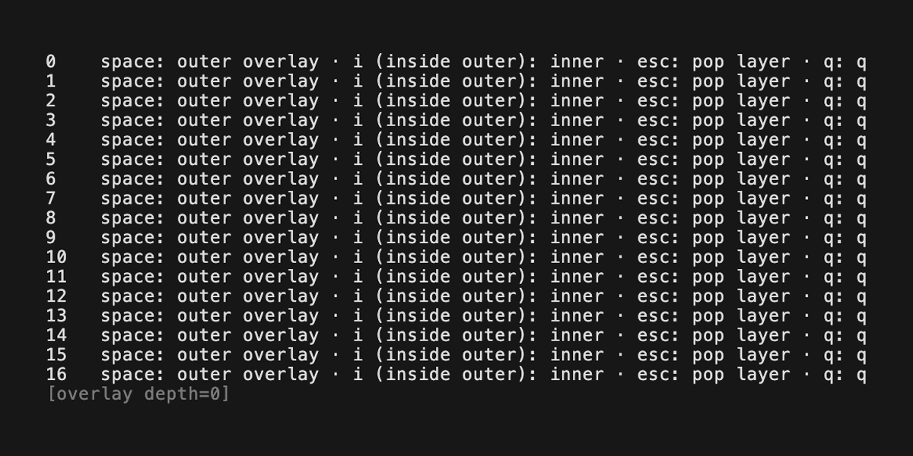

# bubble-overlay

Composable modals and overlay stacks for [Bubble Tea](https://github.com/charmbracelet/bubbletea): **v1** (`View() string` + `OverlayView` / `OverlayStack`) and **v2** (`View() tea.View` + [`overlayv2`](v2/)).


## Requirements

- **Go 1.25+** (this module includes `charm.land/bubbletea/v2` alongside Bubble Tea v1.)

## Installation

```bash
go get github.com/madicen/bubble-overlay
```

The v2 API lives at import path **`github.com/madicen/bubble-overlay/v2`** (package `overlayv2`); you still add the root module once.

## Which API should I use?

| You are on… | Use |
|-------------|-----|
| [Bubble Tea v1](https://github.com/charmbracelet/bubbletea), `View() string` | Package **`overlay`**: `OverlayView`, `OverlayStack`, `OverlayConfig`, `FocusTrap`. |
| [Bubble Tea v2](https://github.com/charmbracelet/bubbletea/blob/main/UPGRADE_GUIDE_V2.md) (`charm.land/bubbletea/v2`), `View() tea.View` | Package **`overlayv2`**: [`Stack`](v2/stack.go), `CompositeView`, shared config from **`overlay`**. |

Both paths use the same **string compositing** for the terminal (`overlay.OverlayView`, grapheme-aware, ANSI/hyperlink-safe). The v2 stack flattens each child `tea.View`, composites, then wraps with `tea.NewView` — see [docs/ADR-v2-bridge.md](docs/ADR-v2-bridge.md).

---

## Bubble Tea v1 — quick start

```go
import overlay "github.com/madicen/bubble-overlay"

func (m model) View() string {
	main := m.renderMain()
	if !m.showModal {
		return main
	}
	modal := lipgloss.NewStyle().Width(40).Render("…")
	return overlay.OverlayView(main, modal, m.width, m.height, row, col)
}
```

**OverlayStack** adds nested modals, dimming, `Center` / `RightDrawer` / `Fixed`, Escape and optional click-outside, and **`FocusTrap`** so your base model skips keys/mouse while overlays are open. See **`examples/simple`**, **`examples/confirm`**, **`examples/stack`**.

---

## Bubble Tea v2 — quick start

```go
import (
	tea "charm.land/bubbletea/v2"
	bov "github.com/madicen/bubble-overlay"
	"github.com/madicen/bubble-overlay/v2"
)

func (m rootModel) View() tea.View {
	w, h := m.width, m.height
	if w == 0 || h == 0 {
		w, h = 80, 25
	}
	v := m.stack.CompositeView(m.mainView, w, h)
	v.AltScreen = true
	return v
}
```

Run **`go run examples/v2simple/main.go`**. Use **`overlayv2.FocusTrap`** like v1 `FocusTrap` for interactive routing.

---

## Usage

`bubble-overlay` composites a string modal over a string main view without destroying the background. It uses display-cell width (grapheme-aware, aligned with lipgloss) and handles ANSI correctly: a full SGR reset (and hyperlink reset) is inserted immediately **before** the modal so the main line’s active pen does not bleed into the dialog, then after the modal the pen that belonged at the right edge of the hole is re-applied so long styled runs (e.g. full-width lipgloss bars) still look correct past the cut.

**`examples/colors`** shows two styled rows with the modal cutting through them; toggle with space.

### Transparency and mask

- **`OverlayViewWithTransparency`**: ASCII space (`' '`) in the modal is treated as transparent so the main view shows through at those cells.
- **`OverlayViewWithMask`**: choose a **mask rune** (e.g. `░`); only those cells pass through to the main view — see **`examples/transparency`**.

**Centering.** **`OverlayViewInCenter(main, modal, viewW, viewH)`** centers the modal in an arbitrary viewport—full terminal, tab strip, or panel—not “full screen only”. Pass the same **`viewW` / `viewH`** you use when compositing that region. When the region’s bounds match the main string’s grid, use **`ModalCellSize(main)`** for **`viewW` / `viewH`**, or call **`OverlayViewInCenterInMain(main, modal)`** which does that for you.

Centering helpers measure the modal with **`ModalCellSize`** (same rules as **`OverlayView`**), not **`lipgloss.Size`**, so placement and hit-testing stay aligned.

Context menus: use **`OverlayViewAtPoint(main, modal, viewW, viewH, anchorTop, anchorLeft)`** (clamp + composite in one step), or **`ClampOverlayOriginAtPoint`** / **`ClampMenuOrigin`** + **`OverlayView`**. Test hits with **`CellInModal`** using post-clamp top/left and **`ModalCellSize(modal)`**.

For “centered but nudged” (e.g. loading line above a label), use **`OverlayViewInCenterWithOffset`** (and transparency/mask variants): offsets apply after centering, then **`OverlayView`** clamps.

Helpers **`OverlayViewInCenter*`**, **`OverlayViewInCenterInMain`**, **`OverlayViewAtPoint*`**, and **`OverlayViewInCenterWithOffset*`** cover common layouts.

### Cookbook

**Full-screen vs inner panel.** Use **`WindowSizeMsg`** width/height as **`viewW` / `viewH`** when the main view fills the terminal. When the overlay sits only over a panel whose string is exactly **`main`**, use **`OverlayViewInCenterInMain(main, modal)`** or **`ModalCellSize(main)`** with **`OverlayViewInCenter`** so the viewport matches the panel grid.

**Menu under cursor (v1 mouse).** Coordinates are **zero-based**. **`tea.MouseMsg`** uses **`X`** = column (left) and **`Y`** = row (top)—same order as **`OverlayView(..., top, left)`** arguments only if you pass **`anchorTop = msg.Y`** and **`anchorLeft = msg.X`** (row first, then column). Example:

```go
out := overlay.OverlayViewAtPoint(base, menu, w, h, msg.Y, msg.X)
t, l := overlay.ClampMenuOrigin(menu, w, h, msg.Y, msg.X)
mw, mh := overlay.ModalCellSize(menu)
inside := overlay.CellInModal(msg.X, msg.Y, t, l, mw, mh)
```

**Stack vs raw compositing.** Prefer **`OverlayStack`** / **`Placement`** when you want **dimming**, **Escape / click-outside**, **nested modals**, and **focus routing** (`FocusTrap`). Use **`OverlayView`** (and helpers) when you only need a **single hole punch** or fully custom update routing.

---

## Consumer integration (`OverlayView` hosts)

**Single source of truth.** Overflow clamping (when the modal is wider or taller than the viewport) is implemented once as **`ClampOverlayOrigin`** and used by **`OverlayView`**. Hosts that duplicate placement logic for hit-testing should call **`ClampOverlayOrigin`** or **`Placement.ClampedOrigin`** with the same `modalW`, `modalH`, `viewW`, and `viewH` they use for compositing—do not reimplement the algorithm.

**Placement.** **`Placement.Origin`** returns coordinates *before* that overflow clamp (it only pins negative top/left to zero). **`Placement.ClampedOrigin`** matches what **`OverlayView`** paints. Use **`ClampedOrigin`** (or **`Origin`** plus **`ClampOverlayOrigin`**) whenever coordinates must align with the compositor.

**Hit-testing.** If you forward **`tea.MouseMsg`** (or v2 mouse messages) and compare against a stored overlay rectangle, that rectangle must use **post-clamp** top/left; comparing against pre-clamp “desired” placement will be wrong when the modal overflows the viewport.

**Coordinates.** **`OverlayView`** top/left are **zero-based** row and column offsets from the top-left of the view string. Bubble Tea v1 **`tea.MouseMsg`** **`X`** and **`Y`** use the same **zero-based** cell indexing, so they align directly with **`ClampOverlayOrigin`** / **`CellInModal`**. For Bubble Tea v2, use the **`X` / `Y`** from the underlying mouse event the same way once your pipeline uses the same width/height as compositing.

**Helpers.** **`ModalCellSize`** and **`CellInModal`** are thin exports over the same helpers used by **`OverlayStack`** for modal bounds and inside/outside checks.

**Behavioral note (sizing).** Modal width/height follow **`strings.Split(modal, "\n")`** and max **`lipgloss.Width`** per line (matching **`OverlayView`**), not a trimmed trailing newline. If you change that measurement in the compositor, update **`internal/layout.ModalCellSize`** and release notes accordingly.

### Checklist when changing the compositor

Before merging overlay geometry or merge behavior changes: exercise **resize**, **modal larger than the terminal**, **mouse inside vs outside** the modal, and **zones vs relative coordinates** if your app uses them. Call out **breaking behavioral changes** in release notes (this repo has no auto-generated changelog—document in your release).

---

## Package reference

| Symbol | Package | Role |
|--------|---------|------|
| `OverlayView`, `OverlayViewWithTransparency`, `OverlayViewWithMask`, `DimSurface` | `overlay` | Hole-punch compositing; dim multiline string. |
| `ClampOverlayOrigin`, `ClampOverlayOriginAtPoint`, `ClampMenuOrigin`, `ModalCellSize`, `CellInModal` | `overlay` | Shared geometry for compositor parity and hit-testing. |
| `OverlayViewInCenter*`, `OverlayViewInCenterInMain`, `OverlayViewInCenterWithOffset*`, `OverlayViewAtPoint*` | `overlay` | Common centered, offset, and anchored layouts. |
| `OverlayConfig`, `Placement`, `Placement.ClampedOrigin` | `overlay` | Per-frame dimming and anchor. |
| `OverlayStack`, `OverlayOnCloser`, `FocusTrap`, `DevStackDepthFooter` | `overlay` | v1 stack and helpers. |
| `Stack`, `ViewAdapter`, `StringPipelineAdapter`, `ViewString` | `overlayv2` | v2 stack + R1 compositor. |

---

## Examples

| Example | Bubble Tea | What it shows |
|---------|------------|----------------|
| `examples/simple` | v1 | `OverlayStack`, center + dim |
| `examples/confirm` | v1 | Yes/no + cmd + `Pop` |
| `examples/stack` | v1 | Nested overlays, `OVERLAY_DEV=1` footer |
| `examples/form` | v1 | `OverlayView` + text input |
| `examples/spinner` | v1 | `OverlayView` + spinner |
| `examples/colors` | v1 | Styled lines through the modal cut |
| `examples/transparency` | v1 | Mask rune pass-through |
| `examples/v2simple` | v2 | `overlayv2.Stack` + `CompositeView` |

```bash
go run examples/simple/main.go
go run examples/confirm/main.go
go run examples/form/main.go
go run examples/spinner/main.go
go run examples/colors/main.go
go run examples/transparency/main.go
go run examples/stack/main.go
OVERLAY_DEV=1 go run examples/stack/main.go
go run examples/v2simple/main.go
```

---

## Gallery

| Confirm | Form | Spinner | Colors | Nested stack | Transparency |
| :---: | :---: | :---: | :---: | :---: | :---: |
|  |  |  |  |  |  |

---

## Recording GIFs (VHS)

Use **`make gifs`** from the repo root. Tapes **`Source "vhs/_env.tape"`**, which clears **`CI`** / **`NO_COLOR`** and sets **`TERM=xterm-256color`** and **`COLORTERM=truecolor`** so lipgloss/termenv emit color ([termenv](https://github.com/muesli/termenv) otherwise assumes no TTY when `CI` is set).

Each tape runs **`go mod download`** inside **`Hide`** before **`go run ./examples/...`** so download lines do not appear in the GIF.
