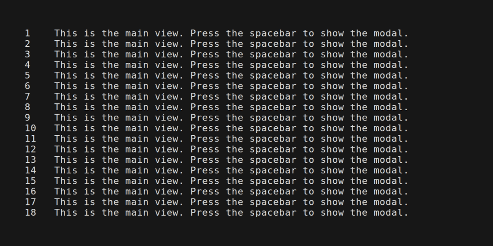
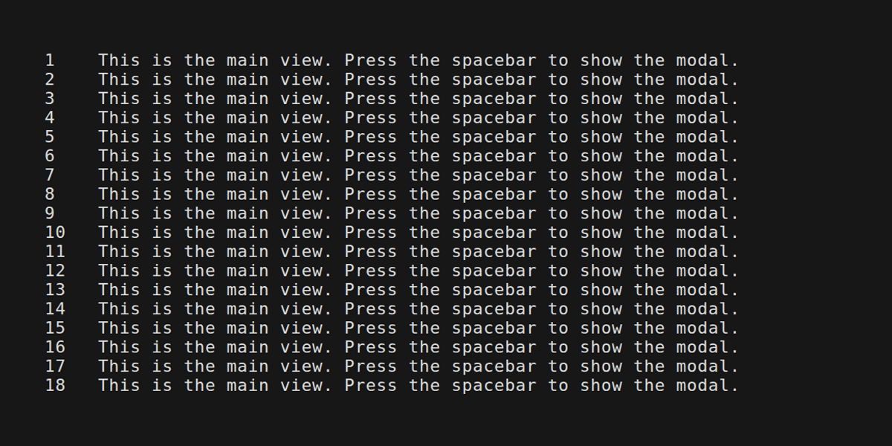
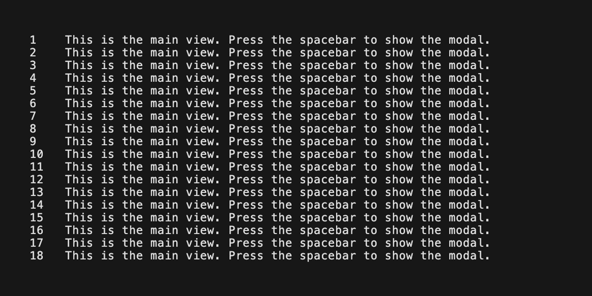
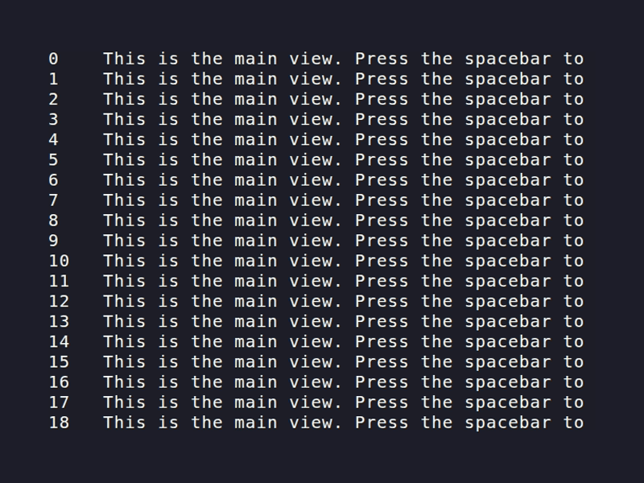
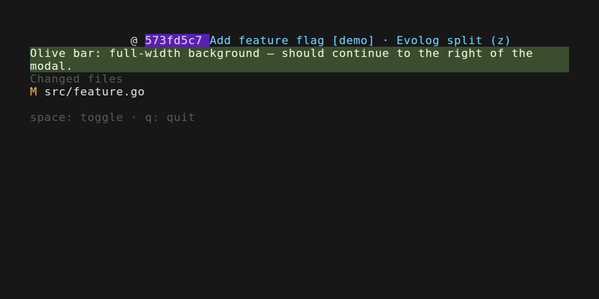
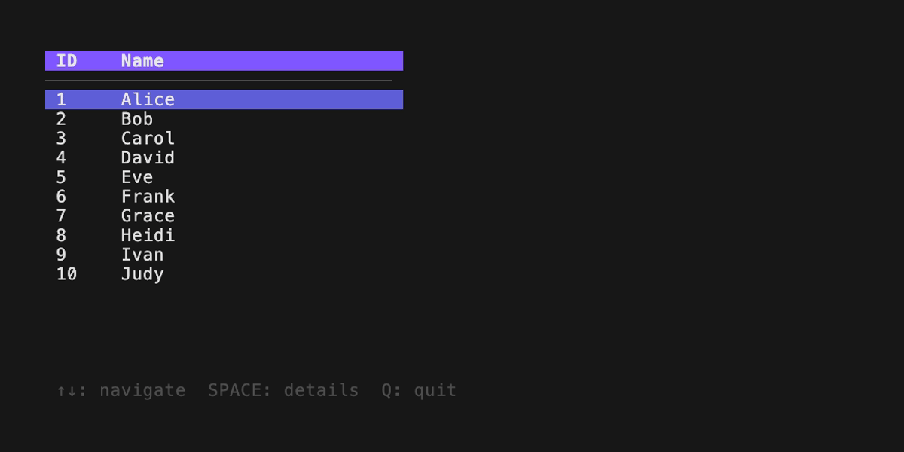

# bubble-overlay

Composable, float-over-content modals for [Bubble Tea](https://github.com/charmbracelet/bubbletea).



## Gallery

| Confirm Dialog | Form Input | Async Spinner | ANSI / colors | Transparency |
| :---: | :---: | :---: | :---: | :---: |
|  |  |  |  |  |

## Installation

```bash
go get github.com/madicen/bubble-overlay
```

## Usage

`bubble-overlay` provides a simple way to overlay a string view (like a modal or dialog) on top of another string view (your main application interface) without destroying the background context. It handles ANSI escape codes correctly: cell widths match lipgloss, and SGR/hyperlink state that would have been set under the modal is re-applied after it so the visible tail of each line still looks right.

**Styled backgrounds under the modal:** If a foreground/background style starts *before* the overlay and continues *after* it (for example one lipgloss block with `.Width(w)` or a long colored segment), the escape sequences that turn that style on may sit entirely underneath the modal. Without re-applying the pen, the tail of the line would render with the terminal’s default colors. This library inserts a reset immediately **before** the modal (so the main line’s active background does not bleed into the first cells of the dialog), then after the modal content it resets again and emits the style that belonged at the right edge of the hole, so the left segment, the modal, and the right segment all line up visually.

The **`examples/colors`** demo shows two cases on adjacent rows: a purple commit hash with a cyan tail (row 0), and a full-width olive background bar (row 1). The modal is anchored so it cuts through both; toggle it with space and check that colors continue correctly to the right of the box.

### Green Screen / Transparency

The library supports a "Green Screen" effect using a mask character. When using `OverlayViewWithMask`, any instance of the chosen `maskRune` in your modal view will be treated as a "hole," allowing the background content to show through exactly at that position. This is useful for providing context or creating "magnifying glass" effects where the modal follows a selection.

Unlike standard transparency which might rely on background colors, this is strictly character-based:
1. **Opaque by default**: Every character in your overlay (including spaces) overwrites the background.
2. **Surgical Transparency**: Only the specific `rune` you provide acts as a pass-through.

Check out **`examples/transparency`** to see this in action.

### Standard Usage

The easiest way to use it is `OverlayViewInCenter`, which automatically calculates the coordinates to center your modal within the terminal area:

```go
import (
    overlay "github.com/madicen/bubble-overlay"
)

// In your View() method:
func (m model) View() string {
    // Render your main application view
    mainView := m.mainContent()

    if m.showModal {
        // Render your modal content (e.g. using lipgloss)
        modalView := m.modalContent()
        
        // Automatically center the modal
        return overlay.OverlayViewInCenter(mainView, modalView, m.width, m.height)
    }
    
    return mainView
}
```

## Running Examples

```bash
go run examples/simple/main.go
go run examples/confirm/main.go
go run examples/form/main.go
go run examples/spinner/main.go
go run examples/colors/main.go
go run examples/transparency/main.go
```

## Recording GIFs (VHS)

Lipgloss uses [termenv](https://github.com/muesli/termenv) to decide whether to emit ANSI. If the **`CI`** environment variable is set (typical in GitHub Actions and some local tools), termenv assumes there is no TTY and switches to the **ASCII** color profile, so **all styles are stripped** — your GIF will look monochrome even though the app is colorful in a normal terminal. The same happens if **`NO_COLOR`** is set.

Tapes in `vhs/` **`Source "vhs/_env.tape"`**, which clears those variables and sets **`TERM=xterm-256color`** and **`COLORTERM=truecolor`** so recordings include color. Run VHS from the **repository root** (as `make gifs` does) so the source path resolves.

Each tape runs **`go mod download`** inside **`Hide`** before **`go run ./examples/...`**. Otherwise Go prints `go: downloading …` lines (especially after new dependencies land) and VHS captures them at the start of the GIF.